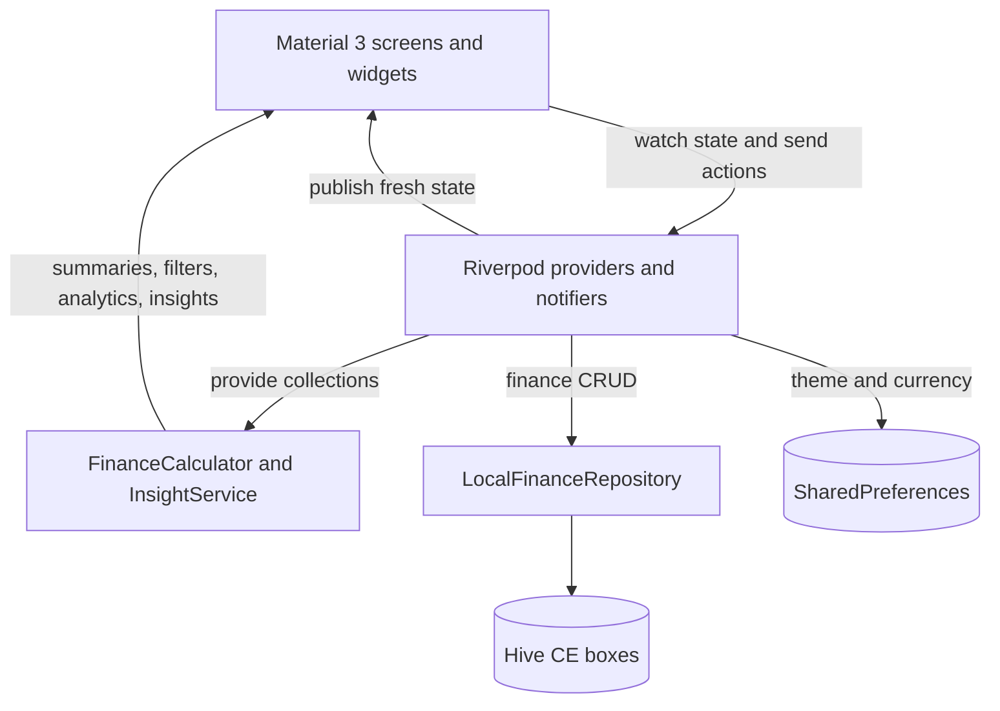

# SpendWise

Offline-first Personal Finance & Expense Management App built with Flutter.

SpendWise is a cross-platform personal finance application for recording income
and expenses, organizing transactions by category, setting monthly spending
limits, and reviewing financial activity through charts and calculated insights.
It is intended for people who want a private, straightforward view of their
day-to-day finances without depending on a remote account or backend service.

The project was built as a portfolio demonstration of production-oriented
Flutter fundamentals: validated CRUD workflows, reactive state management,
local persistence, declarative routing, responsive navigation, testing, and
Material 3 theming. Its main technologies are Dart, Riverpod, GoRouter, Hive CE,
SharedPreferences, and `fl_chart`.

---

## Features

### Dashboard

- Current-month balance, income, expenses, and total budget usage
- Seven-day expense bar chart
- Four most recent transactions with links to edit them
- Monthly budget summary with remaining or exceeded amount
- Pull-to-refresh support

### Transactions

- Create, edit, and delete income and expense records
- Validated amount, category, description, date, and optional notes fields
- Search across descriptions and notes
- Filter by type, category, and custom date range
- Sort by newest, oldest, highest amount, or lowest amount
- Category-aware icons, colors, and currency formatting

### Categories

- Separate income and expense category groups
- Built-in categories seeded on first launch
- Create and edit custom categories with selectable Material icons and colors
- Delete unused custom categories
- Protection against deleting built-in categories or categories in use

### Budgets

- Create, edit, and delete current-month budgets for expense categories
- Track category spending against each limit
- Visual progress with `Safe`, `Near limit`, and `Exceeded` states
- Delete a budget without removing its transactions

### Analytics

- Analyze the current month, previous month, or a custom date range
- Compare income and expenses with a bar chart
- View expense distribution with a category pie chart and itemized totals
- Review the three highest-value expenses for the selected period

### Financial Insights

- Identify the current month's highest-spending category
- Compare expenses with the previous month
- Flag expenses that exceed income
- Warn when a category budget reaches 85% or is exceeded
- Generate insights locally from stored finance data

### Settings

- System, light, and dark theme modes
- Display currency selection for INR, USD, EUR, and GBP
- Category management
- Clear all local finance data or restore the sample dataset
- In-app project and version information

### Local Storage

- On-device persistence for transactions, categories, and budgets
- Explicit map serialization without generated Hive adapters
- Separate preference storage for theme and currency
- Automatic sample categories, transactions, and budgets on first launch

### Responsive UI

- Material 3 components and reusable loading, error, and empty states
- Bottom `NavigationBar` below 700 logical pixels
- Labeled `NavigationRail` at 700 logical pixels and above
- Stateful shell routing that preserves each primary navigation branch
- Scrollable screens and keyboard-aware modal forms

---

## Screenshots

The repository does not currently contain application captures. Genuine device
or emulator screenshots can be added at these reserved paths:

| View | Placeholder |
|---|---|
| Dashboard | `screenshots/dashboard.png` |
| Transactions | `screenshots/transactions.png` |
| Analytics | `screenshots/analytics.png` |
| Budgets | `screenshots/budgets.png` |
| Settings | `screenshots/settings.png` |

No generated or fabricated screenshots are included.

---

## Tech Stack

| Category | Technology |
|---|---|
| Framework | Flutter |
| Language | Dart |
| UI | Material 3 |
| State management | Riverpod |
| Routing | GoRouter |
| Local database | Hive CE for Flutter |
| Preferences | SharedPreferences |
| Charts | `fl_chart` |
| Formatting | `intl` |
| Testing | Flutter Test |
| Static analysis | Flutter Lints |

---

## Architecture

SpendWise uses a feature-oriented, layered structure. Screens are grouped by
feature, while providers, routing, theming, calculations, and formatting are
shared through `core`.



- **Presentation:** Screens and shared widgets render `AsyncValue` state,
  validate input, and dispatch actions.
- **State:** Riverpod owns transaction, category, budget, and settings state.
- **Calculations:** `FinanceCalculator` handles totals, filters, summaries, and
  category grouping. `InsightService` creates deterministic observations.
- **Repository:** `LocalFinanceRepository` gives notifiers a storage API and
  keeps Hive operations out of the UI.
- **Persistence:** Three Hive boxes store finance records; SharedPreferences
  stores theme and currency.
- **Navigation:** GoRouter defines five stateful primary branches plus
  transaction form, category management, and about routes.

This is a pragmatic layered design rather than a full Clean Architecture
implementation. It separates the important responsibilities without adding
abstractions that the current project does not need.

---

## Folder Structure

```text
spend_wise/
├── android/                         # Android runner and configuration
├── ios/                             # iOS runner and configuration
├── linux/                           # Linux desktop runner
├── macos/                           # macOS desktop runner
├── web/                             # Web bootstrap and assets
├── windows/                         # Windows desktop runner
├── lib/
│   ├── core/
│   │   ├── providers.dart           # Riverpod state and preferences
│   │   ├── router/app_router.dart   # Routes and responsive app shell
│   │   ├── theme/app_theme.dart     # Light and dark Material 3 themes
│   │   └── utils/                   # Calculations, icons, and formatting
│   ├── features/
│   │   ├── analytics/presentation/  # Period analytics and charts
│   │   ├── budgets/presentation/    # Monthly budget management
│   │   ├── categories/presentation/ # Built-in and custom categories
│   │   ├── dashboard/presentation/  # Summary, activity, and insights
│   │   ├── settings/presentation/   # Preferences, data controls, about
│   │   └── transactions/
│   │       ├── data/                # Hive-backed repository
│   │       ├── models/              # Transaction, category, budget models
│   │       └── presentation/        # Transaction list and form
│   ├── shared/widgets/              # Reusable cards, states, and list tiles
│   └── main.dart                    # Storage initialization and bootstrap
├── screenshots/                     # Capture instructions and placeholders
├── test/
│   ├── finance_calculator_test.dart # Calculation and insight unit tests
│   └── widget_test.dart             # Transaction tile widget test
├── analysis_options.yaml            # Analyzer configuration
└── pubspec.yaml                     # Package metadata and dependencies
```

The platform folders are generated Flutter runners. `features` owns
feature-specific presentation and transaction data code, `core` contains
application-wide infrastructure, and `shared` contains reusable UI.

---

## Data Flow

```text
User opens Add Transaction
        ↓
Form validates amount, category, and description
        ↓
TransactionsNotifier.save()
        ↓
LocalFinanceRepository.saveTransaction()
        ↓
Transaction map is written to Hive
        ↓
Notifier reloads the sorted collection and publishes AsyncData
        ↓
Watching screens and derived summaries rebuild
```

For reads, the repository deserializes Hive maps into immutable Dart models and
the notifiers expose those collections to the UI. Summaries, filters, charts,
budget progress, and insights are calculated from the in-memory models instead
of being stored as duplicated aggregate data.

---

## State Management

Riverpod keeps application state outside the widget tree, makes dependencies
explicit, and rebuilds widgets when watched state changes. The repository and
SharedPreferences instances are initialized before `runApp` and injected with
`ProviderScope` overrides.

| Provider / notifier | Responsibility |
|---|---|
| `repositoryProvider` | Exposes the initialized local repository |
| `transactionsProvider` / `TransactionsNotifier` | Loads, saves, deletes, refreshes, and publishes transactions |
| `categoriesProvider` / `CategoriesNotifier` | Loads and manages categories |
| `budgetsProvider` / `BudgetsNotifier` | Loads and manages monthly budgets |
| `preferencesProvider` | Exposes SharedPreferences |
| `settingsProvider` / `SettingsNotifier` | Holds and persists theme and currency |
| `currentSummaryProvider` | Derives current-month totals and budget usage |

The finance notifiers use `AsyncNotifier`, allowing their screens to represent
loading, error, empty, and populated states. After a mutation, a notifier reads
the updated collection from the repository and assigns a new `AsyncData` value.
Widgets using `ref.watch` then rebuild automatically.

Derived state is not persisted separately. `currentSummaryProvider` watches
transactions and budgets, while analytics and insights calculate results from
the latest provider values.

---

## Local Database

`main()` initializes Flutter bindings, opens the repository, seeds first-launch
data, loads SharedPreferences, and starts the provider-scoped application.

| Hive box | Stored model |
|---|---|
| `transactions` | `FinanceTransaction` |
| `categories` | `FinanceCategory` |
| `budgets` | `Budget` |

Each immutable model implements `toMap` and `fromMap`. Records are keyed by ID,
so Hive `put` supports creation and replacement. The repository provides reads,
saves, deletes, and a combined clear operation; transaction reads are sorted by
date in descending order.

Seeding runs when the category box is empty. It creates 14 built-in categories,
eight demonstration transactions, and four current-month budgets. Settings can
force the same routine to replace existing data or clear all three boxes.
Theme and currency are persisted independently through SharedPreferences.

---

## Responsive Design

The app shell checks width with `MediaQuery.sizeOf(context)`. Below 700 logical
pixels it uses a bottom Material 3 `NavigationBar`; at 700 and above it uses a
labeled `NavigationRail`.

GoRouter's `StatefulShellRoute.indexedStack` retains the Dashboard,
Transactions, Budgets, Analytics, and Settings branch state. Scroll views,
expanded layouts, fitted monetary values, and wrapping selectors accommodate
available space. Modal forms use `MediaQuery.viewInsetsOf(context).bottom` to
remain usable when the keyboard is visible.

---

## Getting Started

### Prerequisites

- Flutter SDK compatible with Dart `^3.12.2`
- A configured Flutter target and a supported device, emulator, or browser

### Installation

```bash
git clone <repository-url>
cd spend_wise
flutter pub get
flutter run
```

The app creates its local boxes and inserts demonstration data on first launch.

### Quality Checks

```bash
flutter analyze
flutter test
```

To verify formatting without changing files:

```bash
dart format --output=none --set-exit-if-changed .
```

---

## Dependencies

Versions are taken directly from `pubspec.yaml`.

### Runtime

| Package | Version | Purpose |
|---|---:|---|
| `flutter` | SDK | Framework and Material UI |
| `fl_chart` | `^1.1.1` | Dashboard and analytics charts |
| `flutter_riverpod` | `^3.0.3` | State and dependency management |
| `go_router` | `^17.0.1` | Declarative stateful routing |
| `hive_ce_flutter` | `^2.3.4` | Local finance record persistence |
| `intl` | `^0.20.2` | Currency and date formatting |
| `shared_preferences` | `^2.5.4` | Theme and currency preferences |

### Development

| Package | Version | Purpose |
|---|---:|---|
| `flutter_test` | SDK | Unit and widget testing |
| `flutter_lints` | `^6.0.0` | Dart and Flutter lint rules |

---

## Project Highlights

- Cross-platform Flutter application written with null-safe Dart
- Feature-oriented separation of presentation, state, calculations, and storage
- Riverpod `AsyncNotifier` CRUD workflows and reactive derived state
- Offline persistence with explicitly serialized Hive CE records
- Validated create, update, and delete flows
- Data-driven summaries, filters, charts, budgets, and rule-based insights
- Declarative GoRouter navigation with preserved branch state
- Persisted light, dark, and system Material 3 themes
- Responsive bottom and side navigation
- Unit tests for finance logic and a focused widget test

---

## Future Improvements

- Optional authentication and encrypted cloud synchronization
- Database encryption and biometric or PIN protection
- Recurring transactions and scheduled reminders
- CSV or PDF report export and transaction import
- Multiple accounts, transfers, and configurable base currencies
- Future-month budgets and historical budget comparisons
- Broader provider, repository, navigation, and end-to-end tests
- Accessibility audits and localization

---

## Learning Outcomes

Studying SpendWise demonstrates how to:

- Initialize asynchronous local services before mounting a Flutter app
- Model immutable Dart data with explicit serialization
- Coordinate CRUD through Riverpod notifiers and a repository boundary
- Derive summaries and analytics from reactive source collections
- Implement validated forms, filters, sorting, and confirmation flows
- Build charts from local data with `fl_chart`
- Persist lightweight preferences separately from structured records
- Preserve tab state with GoRouter and adapt navigation to screen width
- Test calculation logic and reusable Flutter widgets

---

## License

This project is licensed under the MIT License.
